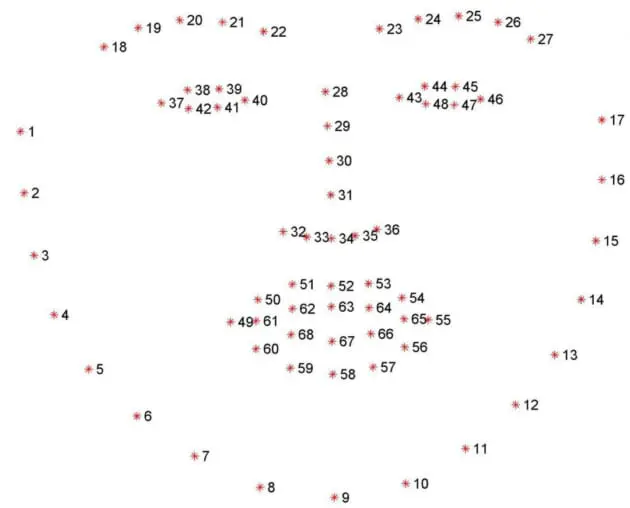

# 68 facial landmark coordinates from iBUG 300-W dataset

[download the model here](https://github.com/davisking/dlib-models)

# relation of eye coordinates - paper on real time blink detection using facial landmarks
[real time eye blink detection using facial landmarks](https://vision.fe.uni-lj.si/cvww2016/proceedings/papers/05.pdf)

# To activate venv
venv\Scripts\Activate.ps1

